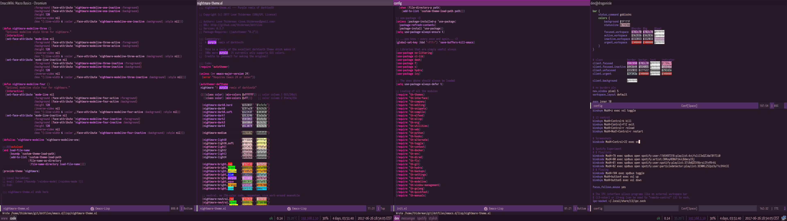

# dotfiles / emacs.d

These are dotfiles originating
from [thiderman](https://github.com/thiderman). They used to be very
versatile and contain lots of things, but since I discovered emacs in
2015 almost all the focus has been on that.

*Main features:*

* A seriously purple interface. Purple is my color, and this
  configuration reflects that _a lot_.
* [Heavy customization](emacs.d/lisp/th-golang.el) of the
  excellent [go-mode](https://github.com/dominikh/go-mode.el).
* Lots and lots of [hydras](https://github.com/abo-abo/hydra).

## Installation

This project
uses [GNU Stow](https://www.gnu.org/software/stow/ "Stow") to manage
symlinks. Run `stow --target=$HOME <dirs> ` in the root of this repo
to symlink the modules to where they belong!

## License

Everything in here is licensed under the MIT license unless otherwise noted.
