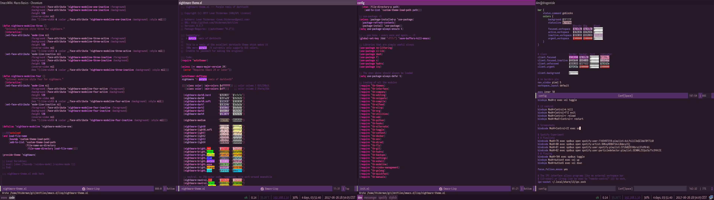

# dotfiles / emacs.d

These are dotfiles originating
from [thiderman](https://github.com/thiderman). They used to be very
versatile and contain lots of things, but since I discovered emacs in
2015 almost all the focus has been on that.



*Main features:*

* A seriously purple interface. Purple is my color, and this
  configuration reflects that _a lot_.
* [Heavy customization](emacs.d/lisp/th-go-mode.el) of the
  excellent [go-mode](https://github.com/dominkh/go-mode).
* Lots and lots of [hydras](https://github.com/abo-abo/hydra).

## Quick install

There is a script that will install them for you.  The installer was
written back in the time when I tried to put my vim/zsh/tmux configs
on all the remote servers I was on.  Nowadays, everything happens in
the aforementioned purple OS, hehe.

Anyways:

```
git clone https://github.com/thiderman/dotfiles .local/share/infect
.local/share/infect/infect install
```

## License

Everything in here is licensed under the MIT license unless otherwise noted.
